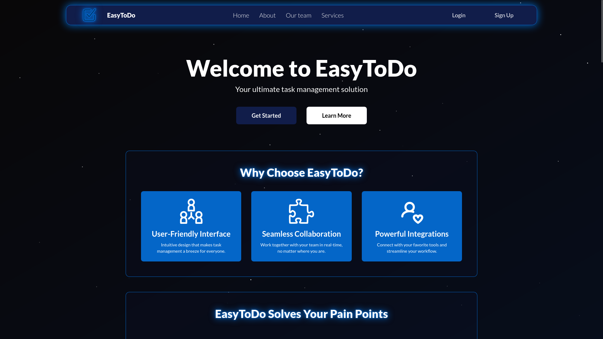
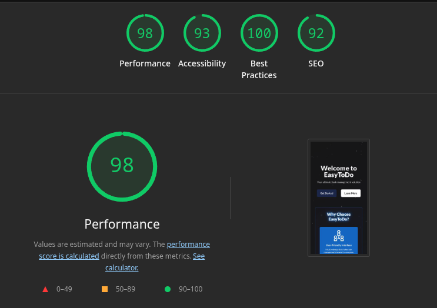
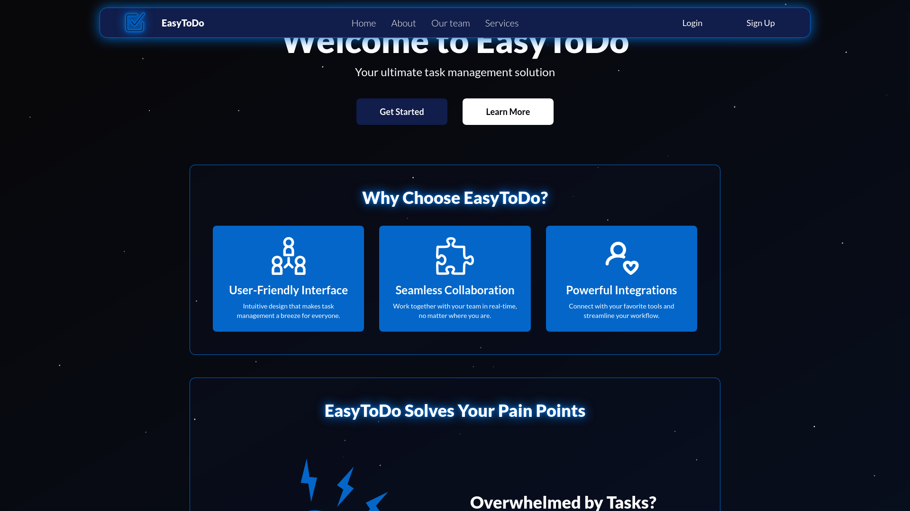
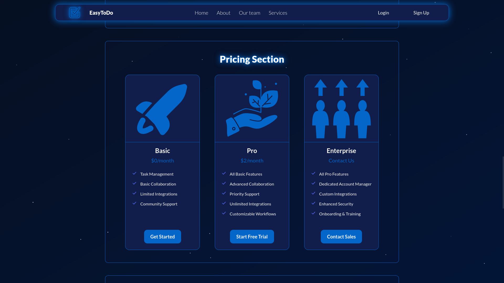
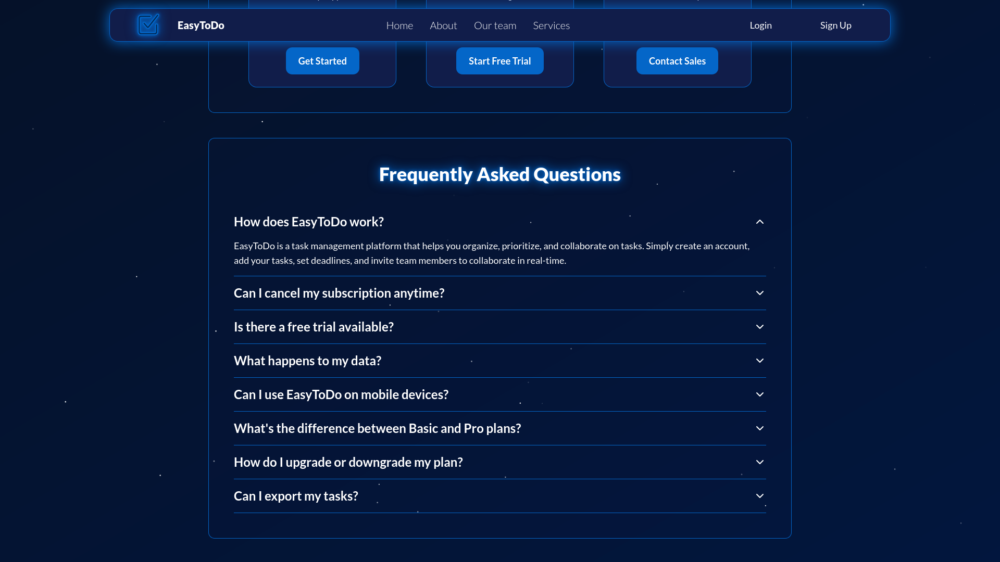
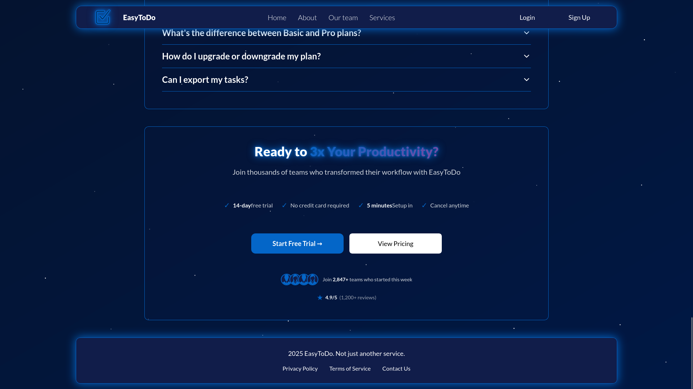
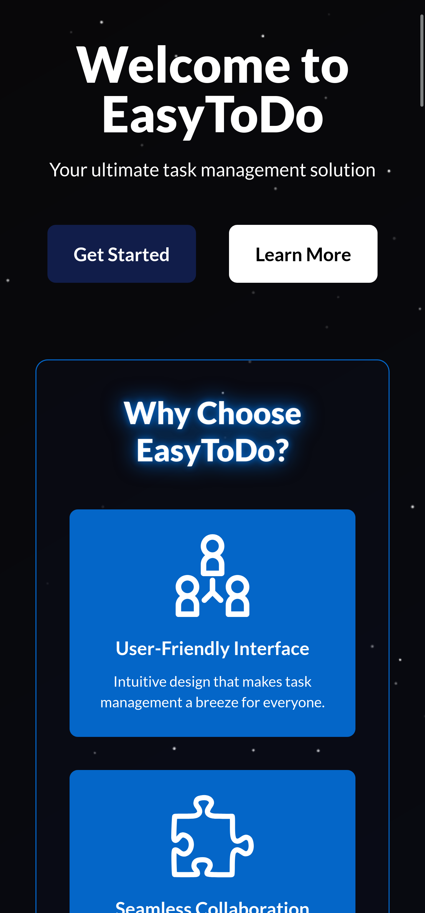
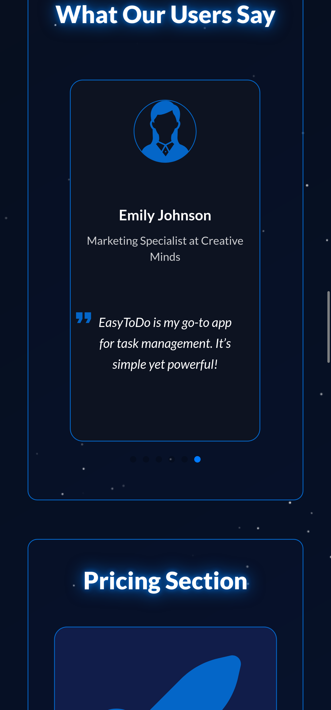
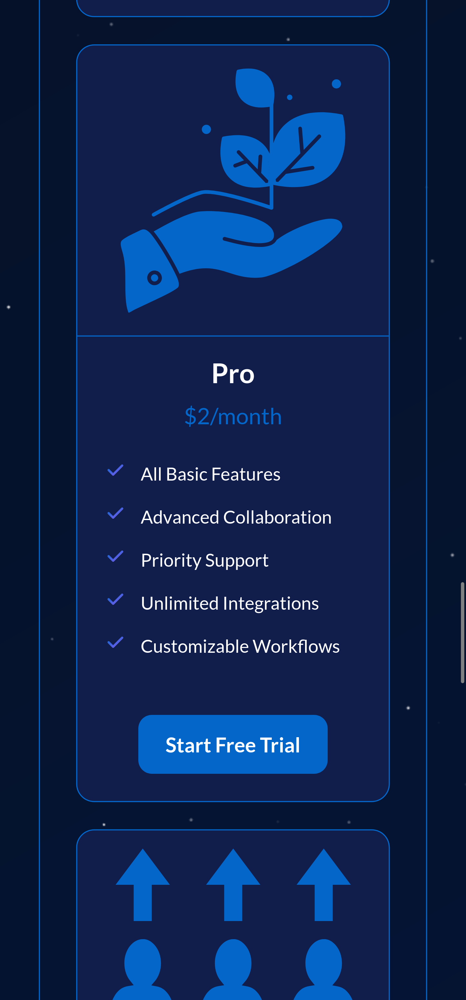
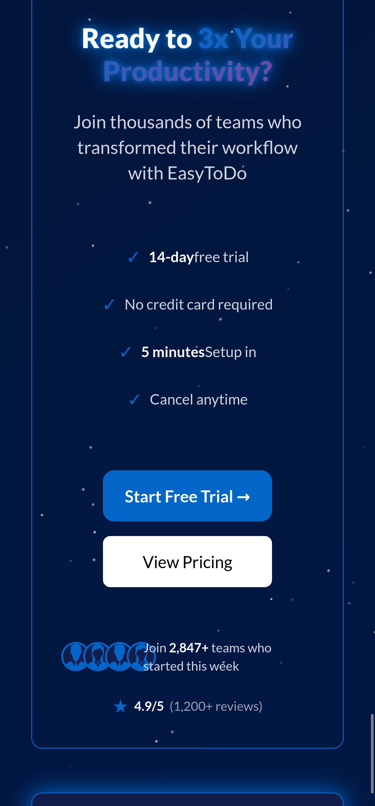

# 🎯 EasyToDo Landing Page

> Modern, high-performance task management landing page built with React and TypeScript



[](https://easytodo.vercel.app)
[](https://easytodo.vercel.app)

## 🚀 Quick Links

- **[Live Demo](https://easytodo.vercel.app)**
- **[Repository](https://github.com/yourusername/easytodo-landing)**

---

## 📊 Performance Metrics



**Lighthouse Scores:**

- 🟢 Performance: 98/100
- 🟢 Accessibility: 93/100
- 🟢 Best Practices: 100/100
- 🟢 SEO: 92/100

**Core Web Vitals:**

- First Contentful Paint: **1.8s**
- Largest Contentful Paint: **2.0s**
- Total Blocking Time: **20ms**
- Cumulative Layout Shift: **0**
- Speed Index: **1.8s**

---

## ✨ Key Features

- 🎨 **Modern Design** - Glassmorphism effects, gradients, custom glow animations
- 📱 **Fully Responsive** - Tested from 320px to 4K displays
- ⚡ **Optimized Performance** - Lazy loading, tree-shaking, code splitting
- ♿ **Accessibility optimized** - Semantic HTML, keyboard navigation, screen reader friendly
- 🧩 **Clean Architecture** -
  Modular components with TypeScript
- 🎭 **Smooth Animations** - Canvas-based starry background with deferred initialization

---

## 🛠️ Tech Stack

```typescript
const techStack = {
    frontend: ["React 18", "TypeScript"],
    styling: ["Tailwind CSS", "Custom theme via @layer"],
    libraries: ["Swiper.js (carousel)", "Lucide React (icons)"],
    bundler: "Vite",
    deployment: "Vercel"
};
```

---

## 📁 Project Structure

```
src/
├── components/
│   ├── layout/              # Page structure
│   │   ├── Header.tsx
│   │   ├── Hero.tsx
│   │   ├── Main.tsx
│   │   └── Footer.tsx
│   ├── sections/            # Container components (data & logic)
│   │   ├── FeaturesSection.tsx
│   │   ├── PricingSection.tsx
│   │   ├── ReviewSection.tsx
│   │   ├── FAQSection.tsx
│   │   ├── UseCaseSection.tsx
│   │   └── CallToActionSection.tsx
│   ├── elements/            # Presentation components (UI only)
│   │   ├── cards/
│   │   │   ├── FeatureCard.tsx
│   │   │   ├── PricingCard.tsx
│   │   │   ├── ReviewCard.tsx
│   │   │   └── UseCaseCard.tsx
│   │   ├── icons/
│   │   │   └── CheckmarkIcon.tsx
│   │   ├── FAQAccordion.tsx
│   │   └── SocialProofFooter.tsx
│   └── StarryBackground.tsx
├── types/
│   └── declarations.d.ts
├── App.tsx
├── main.tsx
└── index.css
```

---

## 🎓 What I Learned & Practiced

### 1. Component Architecture

**Container/Presentation Pattern**

Based on my previous Next.js project where I had significant code duplication issues (similar components copy-pasted
across pages), I implemented a clear separation:

- **Sections (Containers)**: Manage data and business logic
- **Elements (Presentation)**: Receive props and render UI only

**Example:**

```tsx
// Container: manages data
const CallToActionSection = () => {
    const socialProofData = {
        userCount: '2,847+',
        rating: '4.9',
        // ...
    };

    return <SocialProofFooter {...socialProofData} />;
};

// Presentation: receives props and renders
const SocialProofFooter = ({userCount, rating}) => {
    return <div>Join {userCount} teams...</div>;
};
```

**Benefits:**

- ✅ No code duplication
- ✅ Change design once, applies everywhere
- ✅ Easy to test presentation components
- ✅ Scalable for future growth

---

### 2. Smart Component Design

**Universal CheckmarkIcon Component**

```tsx
// One component, multiple styles
<CheckmarkIcon variant="simple"/>    // Text checkmark (✓)
<CheckmarkIcon variant="gradient"/>  // SVG with gradient
```

Instead of duplicating checkmark code, I created a flexible component that adapts based on context.

---

### 3. Data-Driven Architecture

```tsx
// Separate data from presentation
const featuresData: FeatureData[] = [
    {id: 1, imagePath: '...', title: '...', description: '...'}
];

// Easy to modify content without touching components
{
    featuresData.map(feature => <FeatureCard {...feature} />)
}
```

---

### 4. Performance Optimizations

- **Font Preloading**: Added `preconnect` for Google Fonts → saved ~500ms
- **Lazy Loading**: Images load on-demand with `loading="lazy"`
- **Tree-shaking**: Production build removes unused code
- **Deferred Animations**: Canvas animation starts after critical content loads

---

### 5. TypeScript Best Practices

```tsx
// Strict typing for all props
interface SocialProofFooterProps {
    avatars?: string[];
    userCount: string;
    timeframe?: string;
    rating: string;
    reviewCount: string;
}
```

---

### 6. Custom Tailwind Theme

```css
@layer utilities {
    .glow-icon-secondary {
        filter: drop-shadow(0 0 3px var(--color-secondary));
    }

    .section {
        @apply flex flex-col p-8 lg:p-12 bg-primary/10
        backdrop-blur-xs border border-secondary rounded-xl;
    }
}
```

---

## 🖼️ Screenshots

<details>
<summary>📱 Desktop Views</summary>

### Features Section



### Pricing Section



### FAQ Section



### CTA Section



</details>

<details>
<summary>📱 Mobile Views</summary>







</details>

---

## 🚀 Getting Started

### Prerequisites

- Node.js 18+ and npm

### Installation

```bash
# Clone repository
git clone https://github.com/yourusername/easytodo-landing.git

# Navigate to project
cd easytodo-landing

# Install dependencies
npm install

# Start development server
npm run dev
```

### Build for Production

```bash
# Create optimized production build
npm run build

# Preview production build locally
npm run preview
```

---

## 🧪 Testing Performance Locally

```bash
# Build production version
npm run build && npm run preview

# Open in incognito mode (disable extensions)
# Chrome DevTools → Lighthouse → Generate Report
```

**Note**: Lighthouse simulates Slow 4G network. Real users experience faster load times.

---

## 🎓 Lessons Learned

**The Problem (Previous Project):**

In my previous Next.js project (Noble Homes International), I encountered
significant maintainability issues due to code duplication:

1. **Duplicate Components**: Created separate `RotatingCard` and
   `ReviewsRotatingCard` components that shared 80% of their code
    - When I found a bug in the rotation logic, had to fix it in two places
    - Risk of inconsistent behavior between similar components

2. **Copy-Paste UI Elements**: Homepage had 7 identical `ReviewsRotatingCard`
   instances with ~15 lines of repeated props each
    - Changing hover styles required manual updates in 7 places
    - Led to inconsistencies and typos (found "grop-hover" instead of "group-hover")

3. **Repeated Utility Code**: Same animation declarations in 8+ files

```tsx
   // This was repeated everywhere:
const leftToRightAnimation = animations.slide("left", 1);
const rightToLeftAnimation = animations.slide("right", 1);
// ...
```

**My solution in this project:**

I redesigned my approach with these principles:

```tsx
// Before: Multiple similar components
<ReviewsRotatingCard1 props.../>
<ReviewsRotatingCard2 props.../>
<ReviewsRotatingCard3 props.../>

// After: Data-driven architecture
const reviewsData = [...];
{
    reviewsData.map(review => <ReviewCard {...review} />)
}
```

**Key Improvements:**

- **Single Source of Truth**: One component definition, multiple instances
- **Data Separation**: Content lives in data arrays, not JSX
- **Maintainability**: Design changes in one place affect all instances
- **Scalability**: Adding new sections is just adding data, not copy-paste

**Result**:

- Reduced codebase by ~200 lines of duplicates
- Bug fixes now apply universally
- Much faster to add new features
- Prepared for unexpected project growth

This experience taught me that **good architecture isn't about following
patterns blindly** - it's about solving real problems you've encountered.

## 🌐 Browser Support

- Chrome (latest)
- Firefox (latest)
- Librewolf (latest)
- Safari (latest)
- Edge (latest)

---

## 📝 License

MIT License - feel free to use this project for learning purposes.

---

## 🤝 Connect

- GitHub: [@Fixer201](https://github.com/Fixer201)

---

⭐ **If you found this project helpful, please consider giving it a star!**